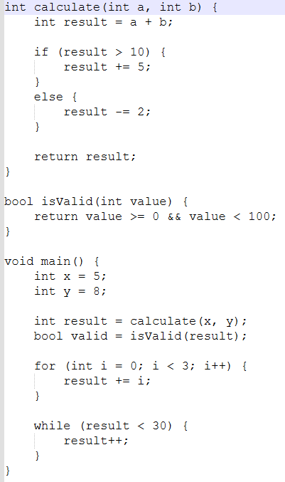
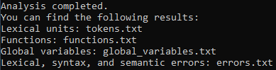
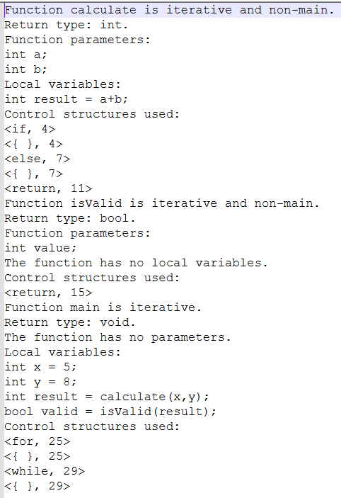
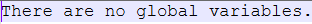
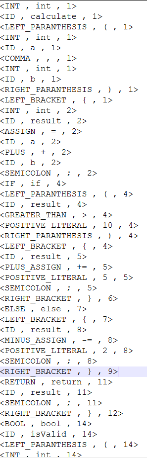
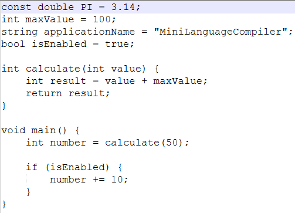
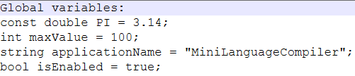
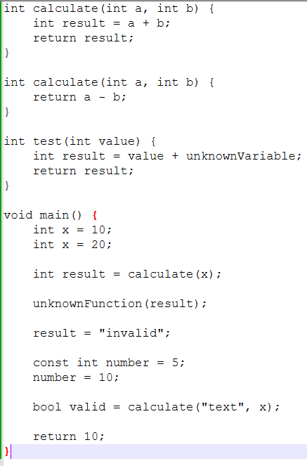
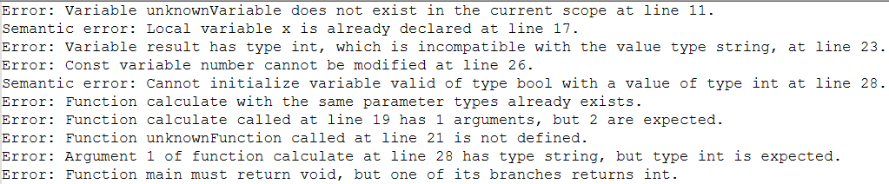

# 🧩 Mini Language Compiler


> A C# console application that implements a custom mini-language compiler using ANTLR4, featuring lexical and syntactic analysis, semantic checking, type validation, function analysis, symbol tables, and detailed error reporting.

## 📖 Overview

This project was originally developed as a university assignment for the Formal Languages and Compilers course, using C#, ANTLR4, and .NET Framework 4.8.

The objective was to develop a compiler for a custom mini-programming language capable of analyzing and validating source programs. The compiler performs lexical analysis, syntactic analysis, and semantic validation, while also collecting information about variables, functions, parameters, and control structures.

This repository contains a refactored version of the original assignment, featuring cleaner code, improved readability, translated error messages, removed unused dependencies, and improved code organization while preserving the original functionality.

## 📚 Original Assignment

The original assignment required developing a compiler in ANTLR for a custom mini-programming language.

The compiler was required to:

- Read the source program from a text file
- Define lexical units including:
  - identifiers
  - numeric constants and string literals
  - keywords
  - arithmetic, relational, logical, assignment, increment, and decrement operators
  - delimiters
- Ignore whitespace and line/block comments
- Define syntactic rules for the mini-language
- Generate lexical and syntactic information from the source program
- Collect information about:
  - global variables
  - functions and their parameters
  - local variables
  - control structures such as `if`, `else`, `for`, and `while`
- Use the Visitor pattern for processing the program structure
- Detect and report lexical, syntactic, and semantic errors

### Semantic Validation

The compiler was required to validate rules including:

- Uniqueness of global variables
- Uniqueness of functions based on name and parameter types
- Validity of function calls
- Exactly one `main` function
- Prevention of calls to `main`
- Usage of variables only after declaration
- Uniqueness of local variables within a function
- Prevention of conflicts between parameters and local variables
- Type compatibility during variable initialization
- Correct number of function call arguments
- Type compatibility between function arguments and parameters
- Return type compatibility
- Required `return` statements for non-`void` functions
- Prevention of assignments to constant variables

## ✨ Features

- 🔤 **Lexical Analysis**
  - ANTLR4 lexer generated from the custom grammar
  - Support for identifiers, literals, keywords, operators, and delimiters
  - Custom lexical error handling

- 🌳 **Syntax Analysis**
  - Custom grammar defined in `MiniLanguage.g4`
  - ANTLR4-generated parser
  - Custom syntax error handling

- 🧠 **Semantic Analysis**
  - Symbol table management
  - Variable declaration validation
  - Function declaration validation
  - Function call validation
  - Type compatibility checking
  - Return type validation
  - Constant variable protection
  - `main` function validation

- 🔎 **Expression Type Checking**
  - Arithmetic expressions
  - Relational expressions
  - Logical expressions
  - Assignment expressions
  - Function call expressions

- 🔧 **Program Structure Analysis**
  - Global variables
  - Functions and parameters
  - Local variables
  - `if` / `else` statements
  - `for` loops
  - `while` loops
  - `return` statements

- 🛡️ **Error Reporting**
  - Lexical errors
  - Syntax errors
  - Semantic errors
  - Detailed error messages with source line information

- 🧩 **Visitor Pattern**
  - Visitor-based processing of functions, statements, and expressions

## 🏗️ Compiler Architecture

The following diagram illustrates the high-level architecture of the Mini Language Compiler, from source code input to lexical, syntactic, and semantic analysis.

```text
                  Source Program
                 (.txt / mini-code)
                        │
                        ▼
              ┌───────────────────┐
              │   ANTLR4 Lexer    │
              └─────────┬─────────┘
                        │
                        ▼
              ┌───────────────────┐
              │   ANTLR4 Parser   │
              └─────────┬─────────┘
                        │
                        ▼
              ┌───────────────────┐
              │  Visitor Pattern  │
              └─────────┬─────────┘
                        │
          ┌─────────────┼─────────────┐
          ▼             ▼             ▼
   FunctionVisitor  StatementVisitor  ExpressionTypeVisitor
          │             │             │
          └─────────────┼─────────────┘
                        ▼
              ┌───────────────────┐
              │ SemanticChecker   │
              └─────────┬─────────┘
                        │
              ┌─────────┴─────────┐
              ▼                   ▼
       Symbol Tables         Error Reporting
       Variables             Lexical Errors
       Functions             Syntax Errors
       Parameters            Semantic Errors
       Return Types
       Control Structures
```

## 📂 Project Structure

```text
MiniLanguageCompiler/
├── MiniLanguageCompiler.sln
├── README.md
├── .gitignore
│
└── MiniLanguageCompiler/
    ├── MiniLanguage.g4
    │
    ├── MiniLanguageLexer.cs
    ├── MiniLanguageParser.cs
    ├── MiniLanguageVisitor.cs
    ├── MiniLanguageBaseVisitor.cs
    │
    ├── FunctionVisitor.cs
    ├── StatementVisitor.cs
    ├── ExpressionTypeVisitor.cs
    ├── SemanticChecker.cs
    │
    ├── Variable.cs
    ├── Parameter.cs
    ├── FunctionCallInfo.cs
    │
    ├── LexerErrorListener.cs
    ├── ParserErrorListener.cs
    │
    ├── Program.cs
    ├── App.config
    ├── packages.config
    └── Properties/
        └── AssemblyInfo.cs
```

### Key Components

- `MiniLanguage.g4` — ANTLR4 grammar defining the lexical and syntactic rules of the mini-language.
- `MiniLanguageLexer.cs` — generated lexer responsible for tokenizing the source program.
- `MiniLanguageParser.cs` — generated parser responsible for syntactic analysis.
- `FunctionVisitor.cs` — processes function declarations and collects function-related information.
- `StatementVisitor.cs` — processes statements and control structures such as `if`, `else`, `for`, `while`, and `return`.
- `ExpressionTypeVisitor.cs` — determines expression types and validates expression-related semantics.
- `SemanticChecker.cs` — performs semantic validation and reports semantic errors.
- `Variable.cs` — represents variables and their properties.
- `Parameter.cs` — represents function parameters.
- `FunctionCallInfo.cs` — stores information about function calls.
- `LexerErrorListener.cs` — handles lexical errors.
- `ParserErrorListener.cs` — handles syntax errors.
- `Program.cs` — application entry point and compiler execution flow.

## 🛠️ Built With

- C# 7.3
- .NET Framework 4.8
- ANTLR4
- ANTLR4 Runtime Standard 4.13.1
- Visitor Pattern
- Visual Studio

## ⭐ Highlights

- Custom mini-language compiler developed using ANTLR4
- Lexical and syntactic analysis using a custom ANTLR4 grammar
- Semantic analysis with type checking and symbol table management
- Visitor-based processing of functions, statements, and expressions
- Detection and reporting of lexical, syntax, and semantic errors
- Generation of token, function, global variable, and error reports
- Refactored codebase with improved readability, naming, and resource handling

## 🎯 Concepts Demonstrated

- **Compiler Design**
  The project implements the main stages of a compiler for a custom mini-language, including lexical analysis, syntax analysis, and semantic analysis.

- **ANTLR4**
  ANTLR4 is used to define the grammar of the mini-language and generate the lexer, parser, and visitor infrastructure.

- **Lexical Analysis**
  The lexer processes the source program and identifies lexical units such as keywords, identifiers, literals, operators, and delimiters.

- **Syntax Analysis**
  The generated parser validates the source program against the grammar rules defined in `MiniLanguage.g4`.

- **Visitor Pattern**
  Visitor classes are used to traverse the parsed syntax tree and process functions, statements, and expressions.

- **Semantic Analysis**
  The compiler validates semantic rules such as declarations, function calls, variable usage, type compatibility, and return types.

- **Symbol Tables**
  Variables, functions, parameters, and return types are tracked through dedicated collections used during semantic analysis.

- **Type Checking**
  The compiler validates type compatibility during variable initialization, function calls, and return statements.

- **Error Handling**
  Custom error listeners handle lexical and syntax errors, while semantic validation reports semantic errors.

- **File I/O**
  The source program is read from a text file, while lexical units, functions, global variables, and errors are written to separate output files.

- **Object-Oriented Programming (OOP)**
  The compiler is organized into dedicated classes with separate responsibilities for lexical analysis, parsing, semantic checking, visitors, and data representation.

- **Separation of Concerns**
  Lexer error handling, parser error handling, semantic validation, expression analysis, statement traversal, and function processing are separated into dedicated components.

## 📸 Screenshots

### 1. Main Input

The main input demonstrates a complete mini-language program containing function declarations, parameters, local variables, arithmetic and relational expressions, `if...else` statements, `for` and `while` loops, function calls, and return statements.



---

### 2. Analysis Results

After processing the source file, the compiler displays the generated output files containing the lexical units, function information, global variables, and detected lexical, syntactic, and semantic errors.



---

### 3. Function Analysis

The compiler generates detailed information about each function, including its return type, parameters, local variables, and control structures used. It also identifies whether a function is iterative or recursive and whether it is the `main` function.



---

### 4. Global Variables — No Global Variables

For the first input program, the compiler correctly detects that no global variables are declared.



---

### 5. Lexical Units

The compiler generates a list of lexical units identified in the source program. Each token contains its token type, lexeme, and source line index.



---

### 6. Input with Global Variables

A second input program is used to demonstrate global variable declarations, including constants, numeric values, strings, and boolean values.



---

### 7. Global Variables Detection

The compiler successfully extracts and reports the global variables together with their types and initialization values.



---

### 8. Input with Semantic Errors

A third input program intentionally contains multiple semantic errors, including duplicate declarations, invalid variable usage, incorrect function calls, incompatible types, modification of constants, and invalid return values.



---

### 9. Detected Errors

The compiler detects and reports the errors found during analysis, providing descriptive messages together with the corresponding source line numbers.



## 📋 Requirements

- Windows 10 / Windows 11
- .NET Framework 4.8
- Visual Studio
- ANTLR4 Runtime Standard 4.13.1

## 🚀 Running

1. Clone the repository.

```bash
git clone <repository-url>
```

2. Open the solution in **Visual Studio**.

3. Restore the NuGet packages (if required).

4. Build the solution.

```text
Build → Build Solution
```

or simply press:

```text
Ctrl + Shift + B
```

5. Before running the application, place the source program file named `input.txt` inside the project's `bin/Debug` directory.

The compiler reads the source program from this file at runtime.

```
MiniLanguageCompiler/
└── MiniLanguageCompiler/
    └── bin/
        └── Debug/
            └── input.txt
```

> Important: The `input.txt` file must be present in `bin/Debug` before running the application. Otherwise, the compiler will not be able to find the source file.

6. Run the application.

```
F5
```

or click `Start` in Visual Studio.
   
7. The compiler reads and analyzes `input.txt` and generates the following output files automatically at runtime:

  - `tokens.txt` — generated lexical units
  - `functions.txt` — extracted function information
  - `global_variables.txt` — detected global variables
  - `errors.txt` — detected lexical, syntactic, and semantic errors

These files are created automatically in the application's runtime directory.

8. Modify `input.txt` with a different mini-language program and run the application again to analyze another source program.
   
## 📄 License

This project is released under the **MIT License**.

See the [LICENSE](LICENSE) file for more details.
